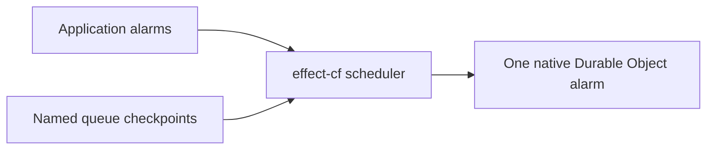

# Durable Object wakeup invariants

Objects wake for incoming application events and enrolled deadlines. They must
be able to drain to idle. A deadline represents a product event, such as expiring
a voice session or sending a reminder; waiting for another component to settle
must use its completion event rather than a polling alarm.

The effect-cf primitives enforce these rules:

- Keepalives use Cloudflare's WebSocket auto-response and never invoke the object.
- Unchanged work cannot keep re-arming at short intervals. Only committed source
  progress or completion replenishes a handler's budget.
- Parked work remains durable, visible and recoverable. It gets at most one
  automatic attempt per hour until progress resumes it; consumers can choose
  a longer recovery interval.
- One scheduler owns the platform alarm. Logical deadlines, attempt state and
  native alarm reconciliation commit or roll back together. Deferred processing
  retains a committed recovery alarm until its final reconciliation.

Managed alarms enforce the retry and progress budget; named wakeups let an
existing durable queue retain its own policy under the same platform alarm owner.
`DurableObjectState.raw` remains an explicit native interoperability boundary;
writing its platform alarm bypasses the scheduler and invalidates its ownership.

## Scheduling and progress

Register a typed alarm service with `DurableObject.make` and enroll work from
an incoming event. SQLite-backed Durable Objects are required.

```ts
import { DateTime, Effect, Layer, Schema } from "effect";
import { DurableObject, DurableObjectAlarm, DurableObjectState } from "effect-cf";

class Expirations extends DurableObjectAlarm.Tag<Expirations>()("Expirations", {
  expire: Schema.Null,
}) {}

export const SessionObject = DurableObject.make(Layer.empty, {
  alarms: Expirations.handlers({
    expire: ({ id }) => Effect.log("Session deadline reached", id),
  }),
  rpc: {
    arm: Effect.fn("SessionObject.arm")(function* (id: string, deadline: number) {
      const alarms = yield* Expirations;
      const state = yield* DurableObjectState.DurableObjectState;

      yield* alarms.transaction((tx) =>
        Effect.gen(function* () {
          yield* state.storage.put(`session:${id}`, { deadline });
          yield* tx.scheduleAlarm({
            tag: "expire",
            id,
            payload: null,
            runAt: DateTime.makeUnsafe(deadline),
          });
        }),
      );
    }),
  },
});
```

`scheduleAlarm` arms or replaces one `{tag, id}`. `scheduleAlarmEarlier` atomically
min-merges that logical alarm's deadline, preserving the existing payload and
repeat when its deadline is already earlier. Other logical alarms always retain
their own deadlines; the scheduler reconciles the earliest effective wake deadline.
`cancelAlarm` removes that logical work and its attempt state.

External enrollment without a source cursor starts a fresh budget and removes
parking immediately, honoring the requested deadline. A successful one-shot
completion or cancellation drains that work to idle. A successfully completed
product repeat starts the next occurrence with a fresh budget.

Scheduling from inside a handler or failure hook is a **self-rearm**, even if
it changes the payload, deadline or alarm ID, or cancels before re-enrolling.
It inherits the active pass's budget. Multiple schedules in one pass do not
charge the same work twice. Detached handler fibers cannot schedule after the
pass ends. Transaction handles must stay on their callback's fiber and cannot
escape it.

When a handler commits real state and still has more work, supply `progress` on
its schedule in the same transaction. This is a nonnegative safe integer source
cursor: a strictly increasing value resets the budget. Replayed or older source
notices cannot reset a live budget. Use a committed version or source sequence;
lease renewals, retry counters and changing wall-clock deadlines are not progress.

By default, failures and unchanged self-rearms have a one-second floor and
exponential backoff: 1, 2, 4, 8, 16, 32 and 64 seconds. The eighth unchanged
attempt parks work for hourly recovery; later failures remain parked.
`retryFailedAfter` and
typed definitions' `retry.initialDelay` select the initial backoff, subject to
the configured floor, budget and recovery interval. Failures retry independently so unrelated due
alarms can proceed. A stale failure cannot overwrite a handler's replacement,
and an unchanged self-rearm is charged only once per pass.

Dispatch and reconciliation use the same index of effective wake deadlines,
ordered by deadline and then storage key. Backing-off and parked work does not
block other alarms or require scanning the retained backlog. Existing logical
schedules are migrated automatically; their logical `scheduledAt` is preserved.

`repeatEvery` is a product schedule, with a **one-minute default minimum**. It advances
from completion time without catch-up invocations. Never use it to poll for a
receipt, settlement, lease, connection heartbeat or a state change. Existing
stored repeats below the configured floor advance at that floor after their next completion.

## Share the alarm with an existing durable queue

Use `Wakeup` when a library already owns durable work, claims, leases and retry
budgets. It contributes one named checkpoint to the shared scheduler. Application
alarms and other queues keep their deadlines when that checkpoint changes or is
cancelled. All operations return Effects.



```ts
class Maintenance extends DurableObjectAlarm.Wakeup<Maintenance>()("library/maintenance") {}

const alarms = DurableObjectAlarm.withWakeups(
  Expirations.handlers({ expire: ({ id }) => Effect.log("Expired", id) }),
  Maintenance.handler(maintenancePass),
);

// Pass this registration as DurableObject.make(applicationLayer, { alarms, ... }).
```

`maintenancePass` is the queue's existing bounded Effect. `withWakeups` accepts
one managed-alarm registration and one or more named wakeup registrations; a
wakeup's `handler` registration also works alone. Stable service keys identify
persisted checkpoints. Duplicate keys, including collisions with the managed
alarm service, fail with `InvalidAlarmRegistrationError` before application
services initialize. Providing a service layer alone does not register its handler.

Enroll source work and its deadline in the same transaction:

```ts
const enroll = Effect.gen(function* () {
  const state = yield* DurableObjectState.DurableObjectState;
  const maintenance = yield* Maintenance;

  yield* maintenance.transaction((tx) =>
    Effect.gen(function* () {
      yield* tx.scheduleEarlier(DateTime.makeUnsafe(deadline));
      yield* state.storage.put("pending-job", job);
    }),
  );
});
```

`scheduleAt` replaces this queue's deadline; `scheduleEarlier` min-merges it.
`scheduledAt` reads the retained checkpoint, and `cancel` removes only this
queue's checkpoint. Transaction handles have the same fiber and lifetime rules
as managed alarms. The raw scheduler also exposes `wakeup(key)`, including on its
transaction handle, for integration with source writes and managed alarms in
one transaction. Register the matching named handler before scheduling it.
For work outside that transaction, commit the checkpoint and dirty generation
first, before starting a mutation or external effect that can fail independently.

Before dispatch, the scheduler commits a native recovery alarm and atomically
moves due named checkpoints to `now + parkedRetryDelay` (at least one hour).
It then runs application alarms and a bounded pool of queue
handlers independently. A failure or defect in one handler does not cancel the
others; parent interruption still interrupts the pass. The fallback survives
process loss and handler success or failure. There is no automatic acknowledgement
or second attempt budget over the queue's own work.

Registrations defer native alarm changes during dispatch. For inline processing,
use `maintenance.withWakesDeferred(inlinePass)` outside any storage transaction.
The scope commits a recovery alarm before running the body, then keeps it armed
while source and checkpoint transactions commit. Nested and concurrent scopes
share the deferral across the object, including changes made by other requests.
The last scope reconciles the earliest remaining deadline on success, failure or
interruption; a cancelled checkpoint is not revived by a buffered hint. Keep the
work bounded: eviction before final reconciliation can delay it until the retained
recovery alarm, rather than the newly requested deadline.

After external work, **re-read the authoritative queue and replace or cancel its
checkpoint in the same transaction as source changes**. Include outstanding
lease and retry deadlines. Cancelling from a stale idle observation can erase
another request's enrollment in the same queue. Keep generation, dirty tracking
and per-lane retry floors in the queue; compare its observed generation inside
that transaction before acknowledging a pass. Keep external effects outside
the transaction, preserve the queue's fencing and idempotency rules, and cancel
when it is idle. This API supplies shared scheduling, not queue ownership or
protection against a consumer that repeatedly re-arms unchanged work.

Cancel a queue's checkpoint before removing its handler. If a due checkpoint has
no registered handler, the dispatcher retains it for hourly recovery and reports
`InvalidAlarmRegistrationError` after allowing other due work to run. Reinstalling
the handler can recover it, including when the deployment kept only a raw `alarm`
hook; deployments do not silently delete retained work.

## Configure scheduling policy

Provide the optional `DurableObjectAlarm.ScheduleConfiguration` reference with
`Layer.succeed`. Omitted fields retain their defaults:

```ts
const schedulingPolicy = Layer.succeed(DurableObjectAlarm.ScheduleConfiguration, {
  minimumRetryDelay: "2 seconds",
  unchangedAttemptBudget: 4,
  parkedRetryDelay: "2 hours",
  minimumRepeatInterval: "20 seconds",
});
```

Pass `schedulingPolicy` as the application layer to `DurableObject.make`. With
other application services, use
`applicationLayer.pipe(Layer.provideMerge(schedulingPolicy))` so policy is available
during service initialization and retained for events. Custom runtimes can provide it to
`DurableObjectAlarm.layer` with `Layer.provide`. A runtime or
`Effect.provideService` override takes precedence for its supplied fields.

| Setting                  | Default  | Constraint                                            |
| ------------------------ | -------- | ----------------------------------------------------- |
| `minimumRetryDelay`      | 1 second | Finite, at least 1 second                             |
| `unchangedAttemptBudget` | 8        | Positive safe integer; cannot disable parking         |
| `parkedRetryDelay`       | 1 hour   | Finite, at least 1 hour and the retry floor           |
| `minimumRepeatInterval`  | 1 minute | Finite, at least 1 second; only for product schedules |

Durations accept Effect `Duration.Input`. Invalid policy raises
`InvalidScheduleConfigurationError` before scheduling commits. The configured
retry floor also applies to per-handler retry delays; exponential backoff caps
at the parked recovery interval. Raising the budget does not resume already
parked work or report it again. Existing deadlines remain enrolled; later
re-arms and repeat completions use the active configuration. Real progress,
completion or explicit external enrollment still resets the work's budget.

These settings tune timing and retry limits. They do not make state polling a
product schedule. A productive workflow that schedules its next step should
commit and supply forward `progress`, even when it uses a new alarm ID.

## Observe and recover parked work

`getAlarmStatus({ tag, id })` returns the logical deadline, retry deadline,
attempt count and parked flag, without decoding the payload. It is available on
both the raw scheduler and typed alarm services. The logical `scheduledAt`
remains stable during failure retries; a separate durable retry deadline controls
when the handler becomes eligible again. Revision checks keep acknowledgements
and retries from overwriting a newer schedule, including identical replacements.

`processDueAlarms` returns new content-free `AlarmParked` events in `parked`.
Install `AlarmReporter` to observe parking transitions, including schedules
outside dispatch. The default emits a warning. A consumer can route the typed
event to its own telemetry:

```ts
const reporting = Layer.succeed(DurableObjectAlarm.AlarmReporter, (event) =>
  Effect.logWarning("AlarmParked", {
    attempts: event.attempts,
    retryAt: DateTime.formatIso(event.retryAt),
  }),
);
```

Provide this layer to the object's application layer. The event contains only
`_tag`, `attempts` and `retryAt`: no identifiers, payloads, failure causes or
application content. Reporting occurs after commit, at most once per parked
episode, and a failing reporter cannot undo the guard. A process loss between
commit and reporting can lose a notification; durable status remains available.
Restarting or evicting the object does not reset attempts or parking.

An incoming completion, new source fact or explicit recovery request can enroll
the retained work at `DateTime.now`, or cancel it if no longer needed. Use a
strictly increasing `progress` cursor when source notifications can be replayed.
Cancellation or successful completion clears the budget so the next independent
product event can enroll normally.

## Consumer migration

Platform `setAlarm`, `setAlarmAfter` and `deleteAlarm` methods have been removed
from the public storage and transaction wrappers. Use stable logical `{tag, id}`
references and register their handlers on the Durable Object.

| Previous pattern                                           | Scheduler API                                                                                                            |
| ---------------------------------------------------------- | ------------------------------------------------------------------------------------------------------------------------ |
| `storage.setAlarm(deadline)`                               | `scheduleAlarm({ tag, id, payload, runAt: DateTime.makeUnsafe(deadline) })`                                              |
| `storage.setAlarm(now + delay)` / `setAlarmAfter(delay)`   | Compute the product deadline with the Effect clock / DateTime, then `scheduleAlarm`                                      |
| `getAlarm()` then `setAlarm(Math.min(existing, deadline))` | `scheduleAlarmEarlier(...)` for the same logical work; independent IDs are already min-merged globally                   |
| `storage.transaction(tx => tx.setAlarm(...))`              | `alarms.transaction(tx => tx.scheduleAlarm(...))`, with application writes through the same object's storage / SqlClient |
| `storage.deleteAlarm()`                                    | `cancelAlarm({ tag, id })` for the logical work being cancelled                                                          |
| An alarm re-arms to check another component's state        | Enroll on that component's completion/progress event; remove the polling loop                                            |

Ordered failure handling and `ProcessDueAlarmsMode` have been removed. Remove
`options.mode`, including `"isolated"`; independent retry is now the only dispatch
behavior. Replace `failure: "ordered"` or an `onFailure` action of `"ordered"`
with `"retry"`. Enroll dependent work from its predecessor's completion event
instead of holding unrelated deadlines behind a failed alarm.

Keep external RPC and network effects outside scheduler transactions. Native
storage failures, interruption and defects before commit roll back logical
schedules and attempt state together. A lost reply after commit cannot undo it.
Alarms remain at-least-once; external effects still need their own idempotency.
Cloudflare's own infrastructure retries are separate and bounded.

## Keepalive protocol

For non-RPC hibernating sockets, run
`DurableObjectWebSocket.installKeepalive()` in the object's constructor or
initialization effect and accept sockets through the hibernation API. The default
exact text request is `effect-cf:ping`; the exact text response is `effect-cf:pong`.
Clients consume these responses outside their application message decoder:

```ts
socket.send("effect-cf:ping");
socket.addEventListener("message", ({ data }) => {
  if (data === "effect-cf:pong") return;
  handleApplicationMessage(data);
});
```

The helper accepts a custom request/response text pair and refuses to replace a
conflicting pair. Cloudflare supports one object-wide pair, so coordinate all
socket protocols hosted by the same object. State-bearing application messages
must use other frames and continue to invoke the object normally.

`DurableObjectRpcWebSocket.layer` defaults to auto-response for the lifetime of
its RPC sockets, including pending requests. With the default JSON serializer,
clients send the exact text `{"_tag":"Ping"}` and receive `{"_tag":"Pong"}`.
The Effect RPC client already uses this protocol. Other text serializers use
their encoded Ping/Pong pair; binary serializers need an explicitly managed text
keepalive and `heartbeat: "passthrough"`. That option preserves an application-
owned pair; installing the matching auto-response remains the application's
responsibility.

Keepalives do not probe application state. If an ordinary in-flight RPC was lost
to eviction, the next application message wakes the constructor and closes that
socket with `1012`; a keepalive alone leaves the object asleep. Applications must
use their operation deadlines and reconnect/resume behavior for lost work.

Cloudflare documents the wake-free behavior of matching text frames in its
[WebSocket auto-response API](https://developers.cloudflare.com/durable-objects/api/state/#setwebsocketautoresponse).
